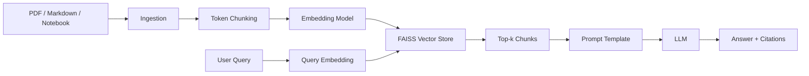

# RAGflow

Production-quality Retrieval-Augmented Generation (RAG) project for technical documents. It ingests PDFs, Markdown files, and Jupyter notebooks; chunks text with citation metadata; embeds chunks; stores vectors in FAISS; retrieves relevant context; and generates cited answers with a configurable LLM.

## Architecture



## Project Structure

```text
data/                 Raw technical documents
notebooks/            Experiments and evaluation notebooks
src/
  ingestion.py        PDF, Markdown, and notebook loading
  chunking.py         Fixed token chunking with overlap
  embeddings.py       Hugging Face and OpenAI embedding wrappers
  vector_store.py     FAISS indexing, persistence, and retrieval
  prompts.py          Basic QA and citation-focused prompt templates
  rag_pipeline.py     End-to-end retrieval and generation pipeline
  evaluation.py       precision@k, recall@k, and qualitative review helpers
  main.py             CLI for indexing and querying
requirements.txt      Python dependencies
```

## Setup

Use the existing conda environment named `dsc291`.

```bash
conda activate dsc291
pip install -r requirements.txt
```

For OpenAI embeddings or generation, set:

```bash
export OPENAI_API_KEY="your-api-key"
```

The default embedding provider is local `sentence-transformers/all-MiniLM-L6-v2`. The default LLM provider is OpenAI. For local generation, pass `--llm-provider local --llm-model <huggingface-model>`.

## Usage

Put source documents under `data/`, then build a FAISS index:

```bash
conda activate dsc291
python src/main.py --index --data-dir data --index-dir index_store
```

Query the index:

```bash
python src/main.py --query "How does the system normalize embeddings?" --index-dir index_store
```

Build and query in one run:

```bash
python src/main.py \
  --index \
  --data-dir data \
  --query "What are the main components of the pipeline?"
```

Use OpenAI embeddings:

```bash
python src/main.py \
  --index \
  --embedding-provider openai \
  --embedding-model text-embedding-3-small
```

Use the citation-focused prompt, which is the default:

```bash
python src/main.py \
  --query "Where is FAISS used?" \
  --prompt-template citation
```

## Pipeline Notes

Ingestion returns `Document` records with provenance such as filename, extension, page number for PDFs, and notebook cell metadata. Chunking creates overlapping fixed-size token windows and carries that metadata into each `Chunk`.

Embeddings are L2-normalized before storage. The FAISS store uses `IndexFlatIP`, so normalized inner product search behaves as cosine similarity. The persisted vector store contains:

```text
index_store/
  index.faiss
  chunks.json
  manifest.json
```

At query time, the pipeline embeds the query with the same embedding model, retrieves top-k chunks, renders a prompt, calls the selected LLM, and returns a `RagResult` with:

```text
answer
sources
prompt
```

Source labels are formatted as:

```text
[Source: filename, page X]
[Source: notebook.ipynb, cell Y]
```

## Evaluation

`src/evaluation.py` provides retrieval metrics and qualitative logging:

```python
from evaluation import RetrievalExample, evaluate_retrieval, mean_metrics

examples = [
    RetrievalExample(
        query="How are embeddings normalized?",
        relevant_chunk_ids={"chunk-id-1"},
    )
]

results = evaluate_retrieval(
    examples=examples,
    retrieve=lambda query, k: vector_store.search(query, embedding_model, top_k=k),
    k=5,
)

print(mean_metrics(results))
```

Available metrics:

- `precision_at_k`
- `recall_at_k`
- mean precision and recall across an evaluation set
- basic qualitative records that track answer text, retrieved source labels, citation markers, and reviewer notes

## Prompt Tuning

Two templates are available in `src/prompts.py`:

- `basic`: concise QA over retrieved context
- `citation`: citation-focused QA that asks the model to cite factual claims

Swap templates with `--prompt-template basic` or by passing `prompt_template="basic"` to `RagPipeline`.
